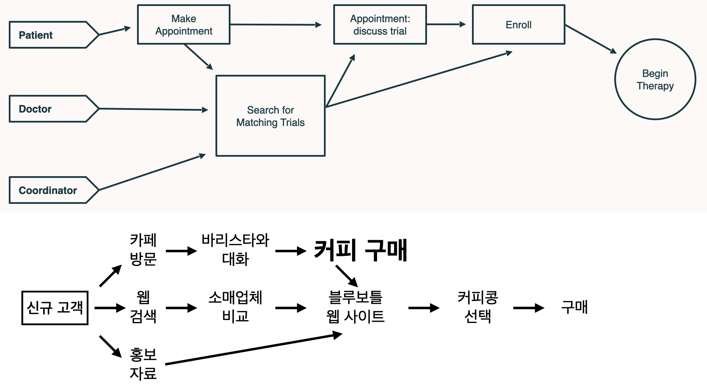

# IT 서비스 방향 잡기(구글 스프린트 기법)

의성 청년 개발자 아카데미는 구글 스프린트 교육을 활용하여 아이데이션과 시장 반응을 확인하는 기획 및 실행 프로세스를 교육합니다. 아카데미의 목표는 '1달 살기 프로젝트'를 통해 참가자들이 아이디어를 만들고, 이를 웹, 앱, 게임 등 다양한 방식으로 표현하는 것입니다.

## 개요
구글의 디자인 스프린트 방법론을 활용한 서비스 기획 프로세스를 학습합니다. 집중 프로세스로 아이디어 도출부터 프로토타입 검증까지 진행하며, 빠르게 서비스의 방향성을 검증하는 방법을 익힙니다.

## 학습 목표
- 구글 스프린트 방법론의 이해와 실습
- 사용자 중심의 문제 정의 능력 향상
- 빠른 프로토타이핑과 검증 방법 습득
- 팀 협업을 통한 아이디어 도출 기법 학습

## 주요 내용
1. Step 1: 문제 정의와 목표 설정
2. Step 2: 솔루션 스케치와 아이디어 도출
3. Step 3: 의사결정과 스토리보드 작성
4. Step 4: 프로토타입 제작
5. Step 5: 사용자 테스트와 피드백 수집

## 교육 과정 안내

USCode 청년 개발자 아카데미의 스프린트 교육 내용은 다음과 같습니다.

* **팀빌딩 (Team Building)**: 팀을 구성하는 과정으로, 리더를 원하는 참가자는 아이디어 또는 팀 문화를 소개하고, 팀원들은 적극적으로 자신을 어필합니다.
* **타겟과 목표 설정하기**: 나아갈 `한줄목표`를 정하고, 팀의 방향을 명확하게 공유하는 단계입니다. 장기 목표는 긍정적으로, 스프린트 질문은 비관적인 태도로 작성합니다.
* **스마트워크시스템**: IT 프로젝트를 위해 협업 툴을 선택하고 활용하는 방법을 배웁니다. 협업 툴은 프로젝트 관리, 파일 관리, 사내 문서 시스템, 메신저 등 다양한 기능을 통합할 수 있습니다.
* **장기적인 목표 설정**: 스프린트 과정에서 계획한 목표의 도착점에서 출발하는 단계입니다. 이 단계에서는 '지도 그리기'를 통해 목표를 구체화합니다.
* **라이트닝 데모 (Lightning Demo)**: 같은 시장을 공략하는 세 회사를 찾아보고, 각 회사의 솔루션을 1분 30초 동안 소개하는 시간입니다.
* **스토리보드 만들기**: 프로토타입 제작 계획을 세우기 위해 스토리보드를 활용합니다. 15개 정도의 칸으로 구성된 격자판을 그리고, 고객이 경험할 스토리를 5~15단계로 나누어 작성합니다.
* **프로토타이핑 (Prototyping)**: 스토리보드를 바탕으로 프로토타입을 제작합니다. 웹, 앱, 소프트웨어와 같은 화면 프로토타입은 AI 코딩 어시스턴트, Figma, Keynote, PowerPoint와 같은 툴을 사용하며, 종이 프로토타입은 워드, 한글 등을 사용할 수 있습니다. 프로토타입은 완벽하기보다 테스트에서 배울 수 있을 정도의 수준으로 구축해야 합니다.
* **시범 운영**: 프로토타입의 오류와 허점을 찾기 위해 팀 내부에서 시범 운영을 진행합니다.
* **5막 인터뷰**: 고객의 긴장을 풀어주고 프로토타입에 대한 솔직한 피드백을 얻기 위한 체계적인 대화 방법입니다. 인터뷰를 통해 얻은 피드백으로 프로토타입의 수정 방향을 설정할 수 있습니다.

## 팀빌딩
팀빌딩은 의성 청년 개발자 아카데미의 스프린트 과정 중 하나입니다. 이 단계는 팀을 구성하는 과정으로, 리더가 되고 싶은 사람은 아이디어 또는 팀 문화를 소개하고 , 팀원들은 적극적으로 자신을 어필합니다.

## 타겟과 목표 설정하기
타겟과 목표 설정하기는 스프린트의 한 단계로, 팀이 나아갈 목표를 정하고 팀의 방향을 명료하게 공유하는 과정입니다. 이 단계에서는 장기 목표와 스프린트 질문을 작성합니다. 장기 목표는 긍정적인 태도로 작성하며, 예를 들어 "더 많은 사람이 IT 교육을 받는다"와 같은 것이 있습니다. 반면, 스프린트 질문은 비관적인 태도로 작성하는데, "해당하는 교육 대상을 충분히 빨리 찾을 수 있을까?" 또는 "학교 이외에 더 많은 수업을 들으려 할까?"와 같은 질문이 해당됩니다. 최종적으로, 결정권자는 하나의 고객과 사건을 선택해야 합니다.  

예를 들어, `USCode 청년개발자 아카데미는 대한민국 청년 대상 1달 살기 프로젝트를 목표로 합니다`

## 스마트 워크 시스템
스마트워크시스템은 IT 프로젝트를 진행하기 위해 협업 툴을 선택하는 것을 의미합니다. 프로젝트 관리, 파일 관리, 사내 문서 시스템, 메신저 등 다양한 기능을 통합한 협업 툴을 활용할 수 있습니다. USCode 청년 개발자 아카데미에서는 IT 프로젝트를 위한 협업 툴 선택을 중요하게 다루고 있습니다.

## 장기적인 목표 설정
장기적인 목표 설정은 스프린트 과정에서 계획한 목표의 도착점에서 출발하는 단계입니다. 이 단계에서는 '지도 그리기'를 통해 목표를 구체화합니다.

* **등장인물 열거하기**: 지도의 왼쪽에 등장인물들을 열거합니다.

* **결말 작성하기**: 지도의 오른쪽에 결말을 작성합니다.

* **단계를 단어와 화살표로 잇기**: 중간에 단어와 화살표를 사용하여 단계들을 연결합니다.

* **단순하게 만들기**: 지도는 단순해야 하며, 5개에서 15개 정도의 단계만 포함해야 합니다.

* **도움 청하기**: 지도가 맞는지 다른 사람에게 도움을 청해 확인합니다.

장기적인 목표의 도착점 예시는 "000 서비스는 000 대상 000를 제공합니다"와 같이 구체적으로 작성할 수 있습니다.

## 라이트닝 데모
라이트닝 데모는 다른 회사의 좋은 솔루션을 참고하는 과정입니다. 같은 시장을 공략하는 회사 세 곳을 찾고, 각 회사의 솔루션을 1분 30초 동안 소개하는 방식으로 진행됩니다. 발표 후에는 이전에 그렸던 지도에 내용을 추가하거나 삭제하며 수정합니다

## 스토리보드 만들기
스토리보드 만들기는 프로토타입 제작 계획을 세우기 위해 스토리보드를 활용하는 과정입니다. 이 단계에서는 격자판을 그리고 , 시작 화면을 선택합니다. 일반적으로 웹 검색, 잡지 표지, 상점 선반 등 접했던 제품이나 서비스를 떠올려 시작 화면을 선택할 수 있습니다. 스토리보드는 15개 정도의 칸으로 구성된 격자판에 , 지도에 따라 5~15개의 단계로 그려야 합니다. 작성된 스토리는 15분 이하로 만드는 것이 좋습니다. 스토리보드 만들기는 고객이 경험할 스토리를 단계에 따라 작성하는 과정입니다.

## 프로토타이핑 만들기
프로토타이핑은 적절한 도구를 선택하여 프로토타입을 제작하는 과정입니다.

* 도구 선택: 화면으로 보는 프로토타입(웹, 앱, 소프트웨어 등)의 경우, Figma, Keynote, PowerPoint와 같은 UX/UI 구축 툴을 사용합니다. 종이로 된 프로토타입(보고서, 브로슈어 등)은 Keynote, PowerPoint, 워드, 한글 등의 문서 작성 소프트웨어를 사용합니다. 서비스 프로토타입은 대본을 작성하고 팀원이 배우 역할을 맡을 수 있습니다. 물리적 공간이나 물건의 경우 기존 것을 개조하거나 3D 프린팅을 활용할 수 있습니다.

* 역할 분담: 프로토타이핑을 위해 팀원들은 역할을 나눌 수 있습니다.

  * 제작 담당: 프로토타입 구성 요소(화면, 페이지, 부품)를 만듭니다.
  
  * 연결 담당: 구성 요소를 모아 이어 붙입니다.
  
  * 글짓기 담당: 프로토타입이 진짜처럼 보이도록 글을 작성합니다.
  
  * 자료 수집 담당: 사진, 아이콘, 샘플 등 구성 요소를 외부에서 신속하게 가져옵니다.
  
  * 인터뷰 담당: 완성된 프로토타입을 가지고 고객 테스트를 수행합니다.

* 사고방식: 프로토타입은 완벽하기보다는 충분한 수준에 만족해야 합니다. 테스트에서 무언가를 배울 수 있을 정도로만 구축하고, 한 번 쓰고 버릴 수 있어야 합니다. 또한, 프로토타입은 진짜처럼 보여야 합니다.

## 시범 운영
시범 운영은 프로토타입을 테스트하여 오류를 찾아내고 허점을 보완하는 과정입니다. 이 과정은 주로 팀 내부에서 진행됩니다.

* **설명 및 확인**: 연결 담당자가 프로토타입을 단계별로 보여주며 설명합니다. 이 과정에서 스토리보드와 대조하여 모든 내용이 포함되었는지 확인해야 합니다.

* **목표 점검**: 장기 목표와 스프린트 질문들을 다시 살펴보는 것도 중요합니다.

* **대본 준비**: 다른 팀이 참가할 인터뷰를 위해 대본을 만들 수 있습니다.

시범 운영을 통해 발견된 오류들은 수정하고, 프로토타입의 허점들은 메워나갑니다.

## 5막 인터뷰
5막 인터뷰는 고객들이 긴장을 풀고 프로토타입 전체를 검토하도록 돕는 체계적인 대화 방식입니다.

이 대화는 5단계로 구성됩니다.
* **친근한 환영인사**: 고객을 환영하고 긴장을 풀어주며, 솔직한 피드백을 원한다고 설명합니다.
* **고객의 배경에 관한 질문**: 가벼운 잡담을 통해 고객에 대해 알아봅니다.
* **프로토타입 소개**: 고객에게 자신의 생각을 입 밖으로 내어 말해달라고 요청합니다.
* **작업과 자극**: 고객이 혼자 힘으로 프로토타입을 이해하는지 지켜보고, 생각을 말할 수 있도록 질문합니다.
* **간단한 정리**: 고객이 생각을 요약할 수 있는 질문을 던집니다.

5막 인터뷰를 통해 고객에게 피드백을 받고, 이를 바탕으로 프로토타입의 수정 방향을 설정할 수 있습니다.